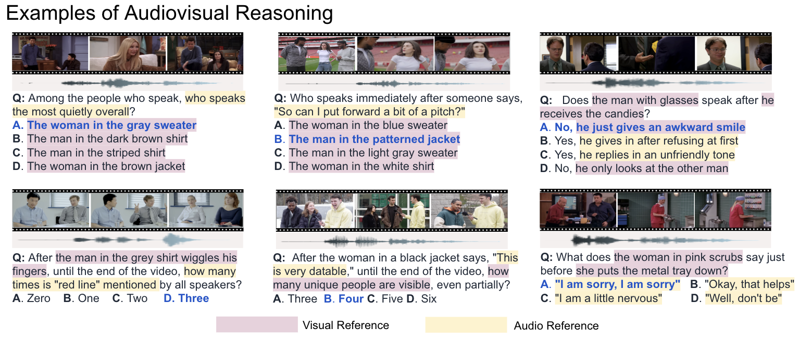
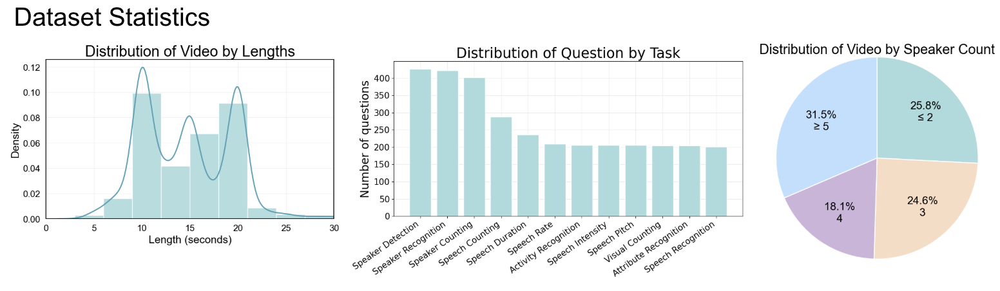

# AV-SpeakerBench

## 공식 링크

- Official GitHub: [plnguyen2908/AV-SpeakerBench](https://github.com/plnguyen2908/AV-SpeakerBench)
- arXiv: [See, Hear, and Understand: Benchmarking Audiovisual Human Speech Understanding in Multimodal Large Language Models](https://arxiv.org/abs/2512.02231)
- Project page: [AV-SpeakerBench project page](https://plnguyen2908.github.io/AV-SpeakerBench-project-page/)
- Dataset: [plnguyen2908/AV-SpeakerBench](https://huggingface.co/datasets/plnguyen2908/AV-SpeakerBench)



## 목적

AV-SpeakerBench는 real-world video에서 speaker-centric audiovisual reasoning을 평가합니다. 핵심은 누가 말했는지, 무엇을 말했는지, speech 또는 visual event가 언제 발생했는지를 audio와 visual cue를 함께 사용해 판단하는 것입니다.

## 데이터셋

- Local path: `/gpfs/public/datasets/AV-SpeakerBench/`
- Official repo: `submodules/AV-SpeakerBench`
- 3,212개 multiple-choice question
- 주요 task: speaker detection, speaker recognition, speech recognition, speech duration/rate/intensity/pitch, visual counting, attribute recognition, activity recognition



## 평가 방식

adapter는 benchmark prompt를 따릅니다.

```text
Select the best answer to the following multiple-choice question based on the video. Respond with only the letter (A, B, C, or D) of the correct option.
...
The best answer is:
```

응답은 official repo의 `extract_characters_regex` 방식에 맞춰 A-D letter를 추출하고, 유효 option이 없으면 오답으로 처리합니다.

## Metric

- Overall accuracy: 전체 3,212개 MCQ 중 정답 letter가 일치한 비율입니다. 모델의 전반적인 speaker-centric audiovisual reasoning 성능을 봅니다.
- Category accuracy: `Audio-centric`, `Visual-centric`, `Speaker-centric`처럼 어떤 modality cue가 중심인지에 따라 묶어 정확도를 계산합니다. audio cue 의존 문제와 visual cue 의존 문제 간 성능 편차를 확인합니다.
- Sub-category accuracy: 세부 task별 정확도입니다. 예시는 아래와 같습니다.

| Sub-category | 평가 목적 |
| --- | --- |
| Speaker Detection | 영상 내 말하는 사람이 존재하는지, 누가 speech source인지 탐지 |
| Speaker Recognition | speaker identity 또는 speaker description을 audio-visual cue로 구분 |
| Speaker Counting | 말하는 사람 수를 추론 |
| Speech Recognition | 발화 내용 인식 |
| Speech Duration | speech가 지속되는 시간/구간 이해 |
| Speech Pitch | 말소리 pitch 비교 |
| Speech Rate | 발화 속도 비교 |
| Speech Intensity | 목소리 크기/세기 비교 |
| Visual Counting | visual object/person count |
| Attribute Recognition | 사람/대상 attribute 인식 |
| Activity Recognition | 사람의 activity 인식 |

## 최종 Output Metric Table

`results/<model>/av_speakerbench/summary.json` 기준 최종 결과는 아래 형태로 정리합니다.

| Model | Size | Speaker Detection | Speaker Recognition | Speaker Counting | Attribute Recognition | Activity Recognition | Visual Counting | Speech Recognition | Speech Duration | Speech Pitch | Speech Rate | Speech Intensity | Speech Counting | Overall |
| --- | --- | --- | --- | --- | --- | --- | --- | --- | --- | --- | --- | --- | --- | --- |
| Qwen3-Omni | 30B | - | - | - | - | - | - | - | - | - | - | - | - | - |
| Nemotron-3-Nano-Omni | 30B | - | - | - | - | - | - | - | - | - | - | - | - | - |

per-sample 예측과 raw response는 `records.jsonl`에 저장합니다.
