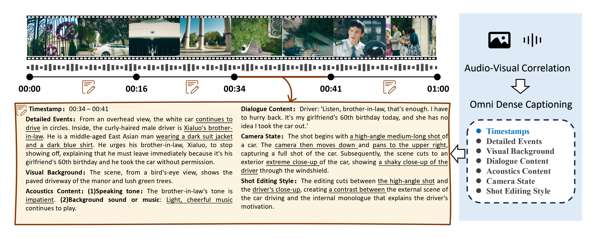

# OmniDCBench

## 공식 링크

- Official GitHub: [yaolinli/TimeChat-Captioner](https://github.com/yaolinli/TimeChat-Captioner)
- arXiv: [TimeChat-Captioner: Scripting Multi-Scene Videos with Time-Aware and Structural Audio-Visual Captions](https://arxiv.org/abs/2602.08711)
- Project page: [TimeChat-Captioner](https://timechat-captioner.github.io/)
- Benchmark dataset: [yaolily/OmniDCBench](https://huggingface.co/datasets/yaolily/OmniDCBench)



## 목적

OmniDCBench는 omni dense captioning을 평가합니다. multi-scene video에 대해 timestamp-aware하고 fine-grained한 audio-visual narrative를 연속적으로 생성하는 능력을 측정합니다.

## 데이터셋

- Local path: `/gpfs/public/datasets/OmniDCBench/`
- Official repo: `submodules/TimeChat-Captioner`
- Annotation: `/gpfs/public/datasets/OmniDCBench/ours_gt_file.json`
- Keypoint annotation: `/gpfs/public/datasets/OmniDCBench/ours_gt_file_keypoints.json`

video archive는 평가 전에 한 번 압축을 해제합니다.

```bash
bash scripts/extract_omnidcbench_videos.sh
```

## 평가 방식

official TimeChat-Captioner inference code에서 확인되는 prompt는 아래 dense caption prompt입니다.

```text
Thoroughly describe everything in the video, capturing every detail. Include as much information from the audio as possible, and ensure that the descriptions of both audio and video are well-coordinated.
```

official code 안에서는 별도의 timestamp JSON 출력 지시 prompt를 찾을 수 없습니다. 대신 `Infer/readme.md`와 evaluator는 모델 출력이 이미 timestamp가 포함된 JSON list라고 가정합니다. 이는 TimeChat-Captioner가 SFT/GRPO를 통해 위 prompt에 대해 structured dense caption을 생성하도록 학습된 전제입니다.

일반 omni model은 동일 prompt만으로 자연어 문단을 출력할 수 있으므로, local adapter는 official evaluator가 읽을 수 있게 structured timestamp 출력을 명시합니다.

```text
Return only a valid JSON array. Do not include markdown fences or any extra text. Each array item must describe one temporal segment and include:
- "timestamp": a string in "MM:SS-MM:SS" format, relative to the start of this clip.
- "caption": a detailed audio-visual caption for that segment.
Use enough segments to cover the full video from beginning to end.
```

adapter는 official `Eval` script가 기대하는 field를 유지해 `predictions.jsonl`을 저장합니다.

- 원본 ground-truth field
- `prediction`
- 모델 출력이 JSON으로 parse 가능한 경우 `prediction_json`

TimeChat-Captioner 예시 설정에 맞춰 최대 `160` frame, `fps=2.0`, `max_pixels=297920`을 사용합니다. 모델 출력은 timestamp가 포함된 structured dense caption JSON string을 기대합니다. 기존 자연어 문단 prediction은 timestamp segment가 없어 F1/mIoU가 0이 되므로 재추론이 필요합니다.

## Metric

TimeChat-Captioner는 `submodules/TimeChat-Captioner/Eval` 아래 metric script를 제공합니다.

- `eval_sodam.py`
- `eval_time.py`

local adapter는 `eval_time.py`를 실행해 metric을 `summary.json`에 기록합니다. 기본 설정은 Gemini judge 없이 temporal metric(F1/mIoU)만 계산하는 `enable_sodam=false`입니다. Gemini judge 기반 SODA_M까지 계산하려면 Gemini credential(`metric_credentials`)을 설정하고 `enable_sodam=true`로 실행합니다.

| Metric | 평가 목적 |
| --- | --- |
| `SODA_M` | dense caption의 temporal alignment와 caption content matching을 함께 평가 |
| F1 | 예측 timestamp/caption segment가 GT segment와 얼마나 잘 대응되는지 평가 |
| mean IoU | 예측 timestamp 구간과 GT timestamp 구간의 평균 overlap 측정 |
| Checklist score | keypoint 기반으로 caption이 시각/음향/발화/카메라 상태 정보를 얼마나 포함하는지 평가 |

OmniDCBench annotation은 아래 dimension을 포함합니다.

| Dimension | 평가 의미 |
| --- | --- |
| `segment_detail_caption` | segment 내 주요 visual/audio event를 상세히 설명했는지 |
| `video_background` | 장소, 배경, scene context를 설명했는지 |
| `acoustics_content` | background music, sound, tone 등 audio 정보를 설명했는지 |
| `shooting_style` | camera/editing/shot style을 설명했는지 |
| `speech_content` | 발화 내용을 정확히 포함했는지 |
| `camera_state` | pan, tilt, zoom, shot scale 등 camera motion/state를 설명했는지 |

## 최종 Output Metric Table

official `Eval` script를 통해 산출한 최종 결과는 아래 table 형태로 정리합니다.

| Model | Size | SODA_M | F1 | mean IoU | Segment Detail | Background | Acoustics | Shooting Style | Speech Content | Camera State | Avg Latency |
| --- | --- | --- | --- | --- | --- | --- | --- | --- | --- | --- | --- |
| Qwen3-Omni | 30B | - | - | - | - | - | - | - | - | - | - |
| Nemotron-3-Nano-Omni | 30B | - | - | - | - | - | - | - | - | - | - |

adapter는 official evaluator 입력으로 사용할 `predictions.jsonl`을 저장합니다.
