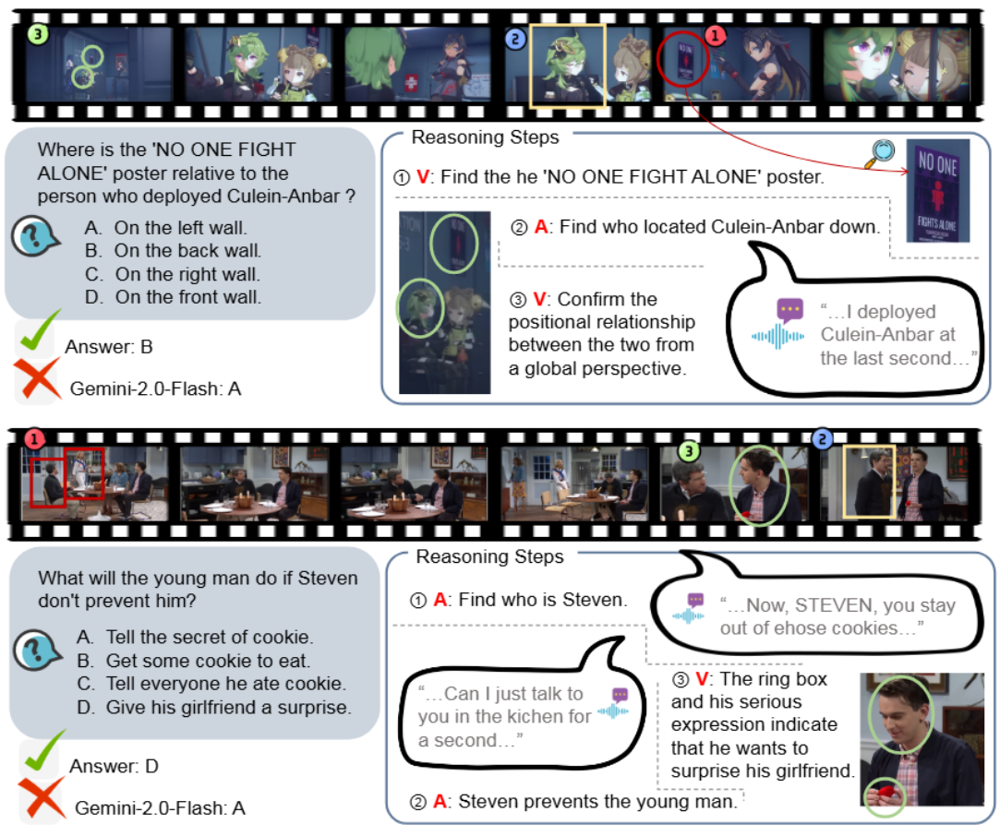
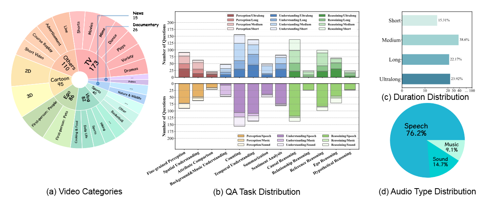
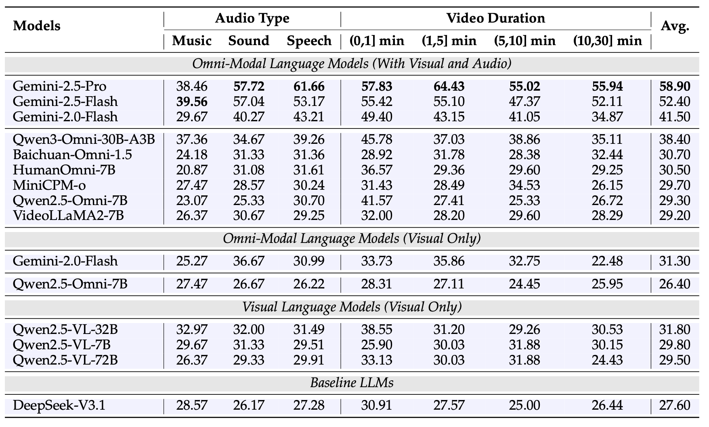

# OmniVideoBench

## Official Links

- Official GitHub: [NJU-LINK/OmniVideoBench](https://github.com/NJU-LINK/OmniVideoBench)
- arXiv: [OmniVideoBench: Towards Audio-Visual Understanding Evaluation for Omni MLLMs](https://arxiv.org/abs/2510.10689)
- Project page: [OmniVideoBench](https://omnivideobench.github.io/omnivideobench_home/)
- Dataset: [NJU-LINK/OmniVideoBench](https://huggingface.co/datasets/NJU-LINK/OmniVideoBench)

## Purpose

OmniVideoBench evaluates audio-visual reasoning, modality complementarity, logical consistency, and long-term temporal reasoning.

## Dataset

- Local path: `/gpfs/public/datasets/OmniVideoBench/`
- Official repo: `submodules/OmniVideoBench`
- Annotation: `/gpfs/public/datasets/OmniVideoBench/data.parquet`
- 628 videos
- 1,000 QA pairs
- 8 video categories
- 13 question types

## Evaluation Method

The official Qwen3-Omni evaluation code samples visual frames and extracts the audio track separately. The adapter mirrors that structure:

- Visual input is sampled at `fps=2.0` with at most `120` frames, matching the official Qwen3-Omni eval settings.
- Audio input is the full original audio track, extracted to WAV and passed as a separate audio input.
- Responses are normalized through the official-style `extract_model_answer` / `clean_text` flow before comparison with the gold answer.

## Metrics

- Overall accuracy: accuracy over all QA pairs. It reflects overall audio-visual joint reasoning ability.
- Video type accuracy: performance per video type, such as `Vlog`, `Movie`, `Cartoon`, `Education`, and `Sports`. It shows variation across genre and shooting style.
- Question type accuracy: performance across the 13 reasoning types, including causal reasoning, spatial understanding, temporal sequencing, attribute comparison, counting, and fine-grained perception. It identifies which reasoning operations the model is weak at.
- Audio type accuracy: performance per audio cue type, such as `Speech`, `Sound`, and `Music`. It separates speech grounding from non-speech sound understanding.
- Duration accuracy: shows how context handling differs between short and long clips.

## Final Output Metric Table

Final results, based on `results/<model>/omnivideobench/summary.json`, are reported in a table showing audio types alongside the main reasoning types.

| Model | Size | Overall | Speech | Sound | Music | Causal Reasoning | Spatial Understanding | Temporal Sequencing | Attribute Comparison | Counting | Fine-grained Perception | Relationship Reasoning | Summarization |
| --- | --- | --- | --- | --- | --- | --- | --- | --- | --- | --- | --- | --- | --- |
| Qwen3-Omni | 30B | - | - | - | - | - | - | - | - | - | - | - | - |
| Nemotron-3-Nano-Omni | 30B | - | - | - | - | - | - | - | - | - | - | - | - |

Per-question raw records are stored in `records.jsonl`.
