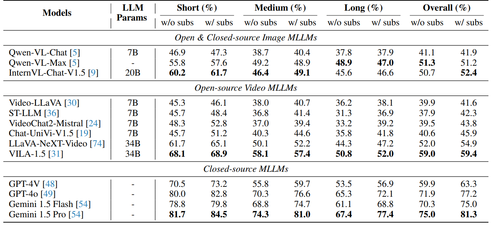
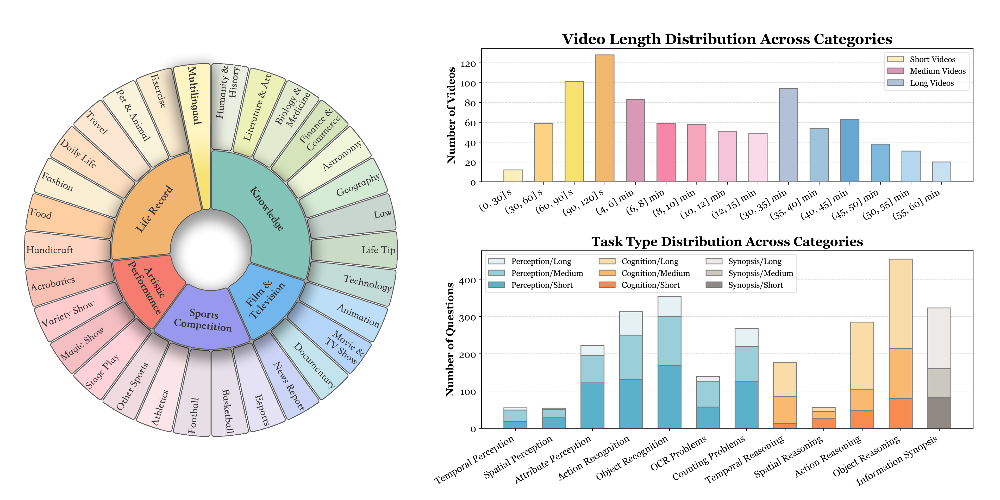

# Video-MME

## Official Links

- Official GitHub: [MME-Benchmarks/Video-MME](https://github.com/MME-Benchmarks/Video-MME)
- arXiv: [Video-MME: The First-Ever Comprehensive Evaluation Benchmark of Multi-modal LLMs in Video Analysis](https://arxiv.org/abs/2405.21075)
- Project page: [Video-MME](https://video-mme.github.io/)
- Dataset: [lmms-lab/Video-MME](https://huggingface.co/datasets/lmms-lab/Video-MME)

## Purpose

Video-MME is a long-video multimodal understanding benchmark. It is well suited to checking long-video comprehension across short, medium, and long duration groups.

## Dataset

- Local path: `/gpfs/public/datasets/Video-MME/`
- Official repo: `submodules/Video-MME`
- 900 videos
- 2,700 human-annotated multiple-choice QA pairs
- Includes short, medium, and long duration groups

## Evaluation Method

The adapter writes `official_results.json` in the nested response format expected by the official evaluation script. Accuracy is defined as what the official Video-MME evaluator computes.

When `use_subtitles: true`, the subtitle text is prepended to the prompt; the default is `false`. The adapter stores model responses as `official_results.json`, a nested JSON structure matching the official `output_test_template.json`, and accuracy is computed by the official evaluator.

## Throughput

The Video-MME adapter measures accuracy only. Video-MME inputs are sampled into frames on the client side, so throughput is bound by frame decoding (CPU) rather than by the model, which makes it unsuitable as a model throughput metric. Model generation throughput is measured separately with `vllm bench throughput` (see `results/throughput.json` and the Model throughput section of the HTML report), which fixes input/output lengths for a fair text-generation speed comparison across quantization variants.

## Accuracy Metrics

Accuracy is computed with the official evaluator as the reference.

| Metric | What it measures |
| --- | --- |
| Overall accuracy | Overall MCQ performance |
| Duration accuracy | Long-context performance on short/medium/long videos |
| Domain accuracy | Performance differences across visual domains |
| Sub-category accuracy | Weak-point analysis by fine-grained topic |
| Task-type accuracy | Performance per task type, such as counting, action reasoning, and information synopsis |

## Final Output Metric Table

Video-MME accuracy is reported from the official evaluator output.

| Model | Size | Overall | Short | Medium | Long | Knowledge | Film & TV | Sports | Artistic Performance | Life Record | Multilingual |
| --- | --- | --- | --- | --- | --- | --- | --- | --- | --- | --- | --- |
| Qwen3-Omni | 30B | - | - | - | - | - | - | - | - | - | - |
| Nemotron-3-Nano-Omni | 30B | - | - | - | - | - | - | - | - | - | - |

The official evaluator input file is `official_results.json`; per-question raw records are stored in `records.jsonl`.
