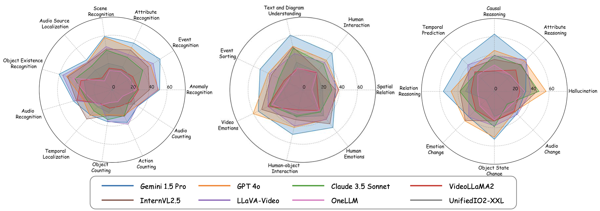
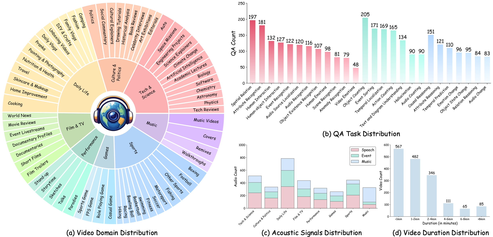
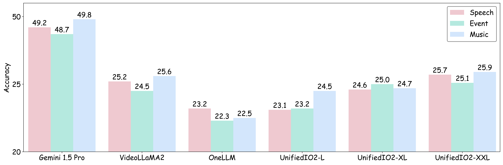

# WorldSense

## Official Links

- Official GitHub: [JaaackHongggg/WorldSense](https://github.com/JaaackHongggg/WorldSense)
- arXiv: [WorldSense: Evaluating Real-world Omnimodal Understanding for Multimodal LLMs](https://arxiv.org/abs/2502.04326)
- Project page: [WorldSense project page](https://jaaackhongggg.github.io/WorldSense/)
- Dataset: [honglyhly/WorldSense](https://huggingface.co/datasets/honglyhly/WorldSense)



## Purpose

WorldSense evaluates real-world omnimodal understanding over synchronized video and audio. It measures whether a model can combine visual, audio, and text cues to perform grounded reasoning.

## Dataset

- Local path: `/gpfs/public/datasets/WorldSense/`
- Official repo: `submodules/WorldSense`
- Annotation: `/gpfs/public/datasets/WorldSense/worldsense_qa.json`
- 1,662 audio-visual synchronized videos
- 3,172 multiple-choice QA pairs
- 8 domains, 67 subcategories, 26 task types



Videos ship as zip archives, so they must be extracted once before evaluation.

```bash
bash scripts/extract_worldsense_videos.sh
```

## Evaluation Method

The official WorldSense repository points to VLMEvalKit for reproduction. The local adapter follows VLMEvalKit's `WorldSense` implementation for the prompt, the exact-matching parser, and dimension aggregation.

The default configuration matches VLMEvalKit's `WorldSense_8frame_audio` variant: instead of passing the video directly, 8 frames are extracted as image inputs and the audio is separated into a WAV file. Responses are parsed for an A-D letter using VLMEvalKit's `extract_characters_regex`, and per-duration/domain/sub-category/task-domain/task-type/audio-class ratings are written to `vlmeval_rating.json`.

The referenced official implementations are VLMEvalKit's [`WorldSense_8frame_audio` dataset config](https://github.com/open-compass/VLMEvalKit/blob/0bfa830fa42fd1d5ac485bbb0bbc78e16c079e18/vlmeval/dataset/video_dataset_config.py#L204-L216), [`WorldSense.build_prompt`](https://github.com/open-compass/VLMEvalKit/blob/0bfa830fa42fd1d5ac485bbb0bbc78e16c079e18/vlmeval/dataset/worldsense.py#L243-L292), [`WorldSense.evaluate`](https://github.com/open-compass/VLMEvalKit/blob/0bfa830fa42fd1d5ac485bbb0bbc78e16c079e18/vlmeval/dataset/worldsense.py#L296-L349), [`extract_characters_regex`](https://github.com/open-compass/VLMEvalKit/blob/0bfa830fa42fd1d5ac485bbb0bbc78e16c079e18/vlmeval/dataset/utils/worldsense.py#L218-L240), and [`get_dimension_rating`](https://github.com/open-compass/VLMEvalKit/blob/0bfa830fa42fd1d5ac485bbb0bbc78e16c079e18/vlmeval/dataset/utils/worldsense.py#L142-L206).

## Metrics

- Overall accuracy: the fraction of MCQs whose predicted option matches the gold answer. It represents overall real-world omnimodal understanding.
- Domain accuracy: accuracy per video domain. Domains such as music, sports, culture/politics, and tech/science show where the model is strong or weak.
- Sub-category accuracy: accuracy at a finer scene/topic granularity than domain. Useful for analyzing model bias and failure patterns on specific content types.
- Task-type accuracy: accuracy across the 26 task types defined by the benchmark. It shows which reasoning operations — audio change, temporal localization, audio counting, spatial relation, and so on — degrade performance.
- Audio-class accuracy: performance by audio cue type, such as `Speech`, `Music`, and `Event`.



## Final Output Metric Table

Final results, based on `results/<model>/worldsense/summary.json`, list per-domain accuracy similarly to the official overall performance table.

| Model | LLM Size | Tech & Science | Culture & Politics | Daily Life | Film & TV | Performance | Games | Sports | Music | Avg |
| --- | --- | --- | --- | --- | --- | --- | --- | --- | --- | --- |
| Qwen3-Omni | 30B | - | - | - | - | - | - | - | - | - |
| Nemotron-3-Nano-Omni | 30B | - | - | - | - | - | - | - | - | - |

Per-sample predictions and raw responses are stored in `records.jsonl`, and VLMEvalKit-format dimension ratings in `vlmeval_rating.json`.
